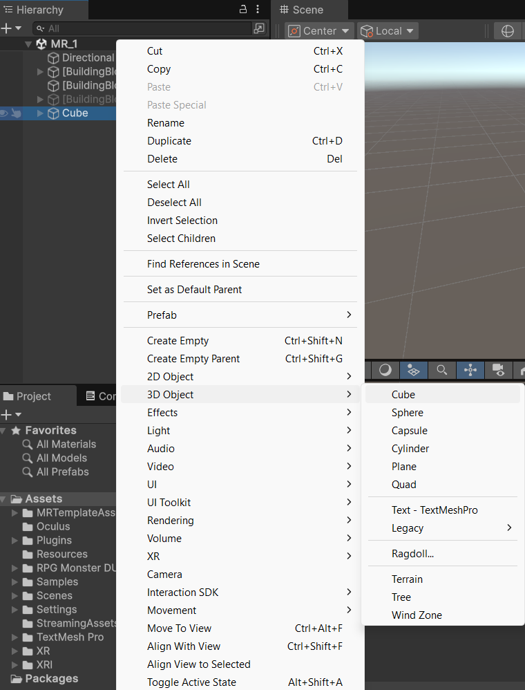
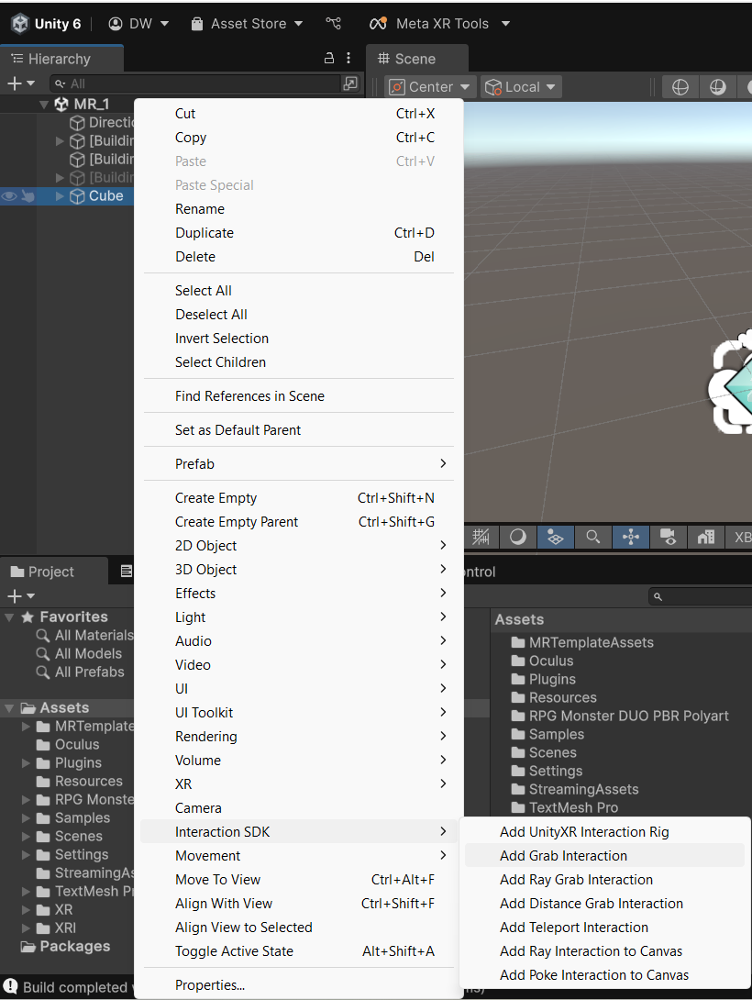

# Membuat Mixed reality sederhana

## Deskripsi
Project sederhana yaitu menggenggam sebuah cube 3D menggunakan building block

## Langkah-langkah membuat MR sederhana

1. **camera Rig**

2. **Passthrough**

3. **Controller Tracking** 

4. **virtual Hands**

5. **Tambahkan Cube 3D** 

6. **Tambahkan Interaction SDK Grab**

